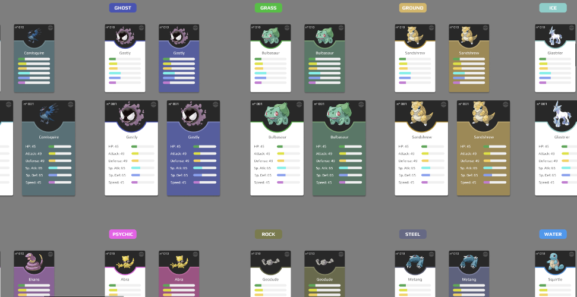

<h1 align="center">
    <a href="https://poke-info.vercel.app/">
        PokéInfo
    </a>
</h1>

<div align="center" >
    
</div>

## 🤨 What is this?

**A project consuming the PokéAPI (a classic for a front-end dev, hehe)**

- This is a front-end-only application
- The PokéAPI is the only external data source
- The goal is purely learning and improvement
- The use of external libraries was avoided whenever possible
- Every idea, structure, and design was made by me

## 👨🏼‍💻 Main Technologies/Tools Used

**Development**
- Preact (framework)
- TypeScript (language)
- Styled-Components (CSS in TS)
- Axios (HTTP client)
- TanStack Query (query & cache manager)
- TanStack Virtual (helps with virtualization)
- NanoId (ID generator)

**Design**
- Figma

## 🤖 Application Features

- **Home Page**
    - Navigation to the main screens

- **Find a Pokémon Page**
    - Allows finding Pokémon encounter locations based on their name (or number) and game version.

- **Pokédex Page**
    - List of all Pokémons (infinite scroll)
    - List of all favorite Pokémons (infinite scroll)
    - You can favorite/unfavorite Pokémons
    - You can search for Pokémons
    - You can change the list view

- **Pokémon Page**
    - General information about a Pokémon, such as:
        - Physical attributes
        - Evolutions
        - Types
        - Abilities
        - Moves
        - ...
    - You can favorite/unfavorite the Pokémon

- **Berries Page**
    - General information about a Berry, such as:
        - Price
        - Category
        - Effect
        - Flavor
        - ...
    - You can search for a Berry
    - You can navigate to the previous, next, or a random Berry

## 🚀 Running Locally

The application is hosted on [Vercel](https://poke-info.vercel.app/),
but if you want to explore or make modifications locally, just do the usual:

```shell
    git clone https://github.com/cicero-mello/poke-info.git
```
```shell
    cd poke-info
```
```shell
    npm i
```
```shell
    npm run dev
```
Finally, open [localhost:5173](http://localhost:5173/).

## 🤯 Final Considerations

Since this project is focused on learning and improvement, I decided to experiment with different patterns throughout the application. For example, screen-specific components can be found in either ```/screen-x/components``` or ```/components/screen-x```. This diversity also applies to other aspects, such as the use of imports.

Below are my notes on Notion, where I document insights gained during development and decisions made throughout the project.

-> [**Notion**](https://vaulted-parade-385.notion.site/PokeInfo-11533bf3f41780e58be2e0f77420a9dd?pvs=4) <-
